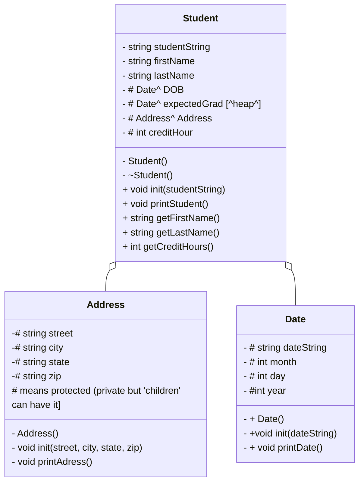

# ReHeapOfStudents

# main.cpp
int main() student vector std::string choice = "";

while loop for while choice != 0, choice = menu

if choice == '1', showStudentNames(students);
clean up before exiting the loop. delStudents(students)

## menu
int menu(){ returning a userinput. 

creates the menu and informs the user which each number option does
0 quit, 2 print all student names, 2 print all student data, 3 find a student. 
returns a string representation of numberic input 

## loadStudent
void loadStudents (reference to a vector of student pointers)
    create file input stream inFile
    create string currentLine

open up inFile with students.csv

read each line into currentLine
    create a new isntance of Student on the heap
    Call the student init method using currentLine
    push that student to the back of the vector

    close the input file

## showStudentNames
void showStudentNames():
    given a reference to a vector of student pointers.
    go through vector one student at a time
    
    for each student:
        get first and last name and present it. print it

## printStudents
gives reference to a vector of student pointers.
go through the vector one student at a time for each student, call that student's printStudent() method.

## findStudent

void findStudent():
    given a reference to a vector of student pointers
    create a string target
    create a boolean notFound, initialize to true
    ask for last name, store in the target
        loop through all the students
            if the target is found in the Name field (string.find command)
            print the student data
        if the student isnt found:
            tell user.

## delStudents

void delStudents():
delete the daya on students after reading them to avoid data left of heap/stack (data leak)
loop through each element in the students vector and delete that element
pass vector by reference(?)

 
#date.cpp
make the constuctor with default values
initiate new values
load input into a new stringstring 'dateString'

#address.cpp

include address.h

createa constructor which has empty place holders for street, city, state, and zip.
    street = " ";

Then, assign what each local variable for this instance is to the variable in the Address class. 

Address::street = street;

void Address::printAddress{
print street, city, state, and zip
}

#Student Class
Student class will pull from Date class and Address classes to creaeach student's address, dob, and expected graduation. 

#Uml

