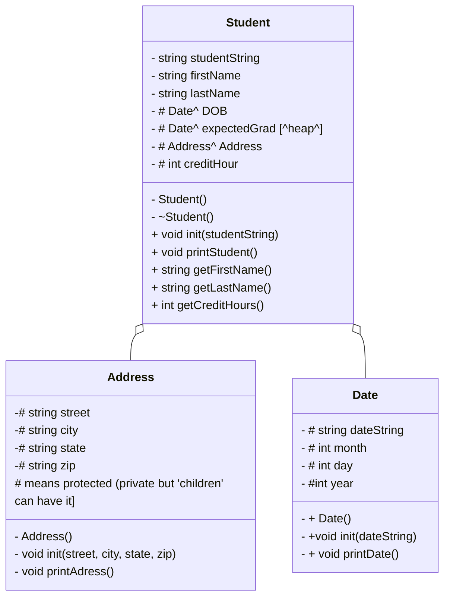

# ReHeapOfStudents
#date.cpp
make the constuctor with default values
initiate new values
load input into a new stringstring 'dateString'

#address.cpp

include address.h

createa constructor which has empty place holders for street, city, state, and zip.
    street = " ";

Then, assign what each local variable for this instance is to the variable in the Address class. 

Address::street = street;

void Address::printAddress{
print street, city, state, and zip
}

#Student Class
Student class will pull from Date class and Address classes to creaeach student's address, dob, and expected graduation. 

#Uml

